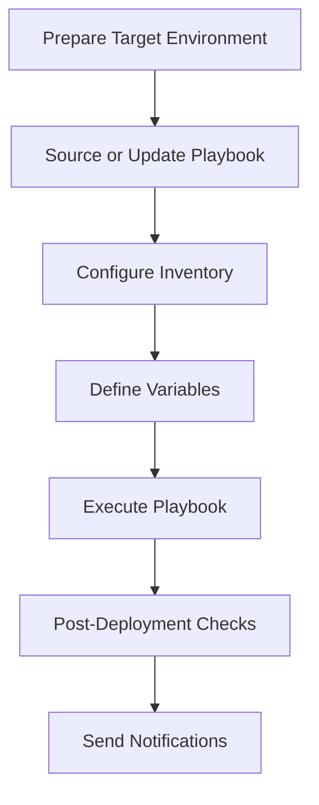

# Ansible Playbook CD Workflow Guide

---

### Author Information

| **Author**   | **Created on** | **Version** | **Last updated by** | **Last edited on** | **Level** | **Reviewer**  |
|--------------|----------------|-------------|---------------------|--------------------|-----------|---------------|
| sachin kumar | 22-07-25    | v1.0  |  sachin kumar |24-07-25     | Internal    | Pritam   |

---

## Table of Contents

1. [Introduction](#1-introduction)  
2. [What is the Playbook CD Workflow](#2-what-is-the-playbook-cd-workflow)  
3. [Playbook CD Workflow Diagram](#3-playbook-cd-workflow-diagram)  
4. [Playbook CD Workflow Explanation](#4-playbook-cd-workflow-explanation)  
   - [Step 1: Prepare Target Environment](#step-1-prepare-target-environment)  
   - [Step 2: Source or Update Playbook](#step-2-source-or-update-playbook)  
   - [Step 3: Configure Inventory](#step-3-configure-inventory)  
   - [Step 4: Define Variables](#step-4-define-variables)  
   - [Step 5: Execute Playbook](#step-5-execute-playbook)  
   - [Step 6: Post-Deployment Checks](#step-6-post-deployment-checks)  
   - [Step 7: Send Notifications](#step-7-send-notifications)  
5. [Best Practices](#5-best-practices)  
6. [Troubleshooting](#6-troubleshooting)  
7. [Frequently Asked Questions (FAQs)](#7-frequently-asked-questions-faqs)  
8. [Conclusion](#8-conclusion)  
9. [Contact Information](#9-contact-information)  
10. [References](#10-references)

---

## 1. Introduction

This document provides a detailed overview of the Continuous Deployment (CD) workflow for Ansible playbooks. It describes how to automate and manage infrastructure or application deployments across various environments using Ansible playbooks, inventories, variables, and external tools.

---

## 2. What is the Playbook CD Workflow

The Continuous Deployment workflow for playbooks ensures that validated infrastructure or application code is automatically deployed to target environments such as staging or production. This process reduces manual effort, increases deployment consistency, and promotes confidence in releases.

The playbook CD workflow typically includes:

- Target environment preparation  
- Sourcing or updating the playbook  
- Inventory and variable setup  
- Playbook execution  
- Post-deployment validation  
- Notifications  

---

## 3. Playbook CD Workflow Diagram



---

## 4. Playbook CD Workflow Explanation

### Step 1: Prepare Target Environment

Ensure all target systems are reachable (usually via SSH) and are ready for Ansible automation.

```bash
ansible all -m ping -i inventory/
```

### Step 2: Source or Update Playbook

Clone or update the desired playbook from your Git repository or other source control.

```bash
git clone https://github.com/your-org/your-playbook-repo.git
# or, if already cloned
git pull origin main
```

### Step 3: Configure Inventory

Define your environment (e.g., staging, prod) using Ansible inventories.

**Example: `inventory/prod/hosts.ini`**

```ini
[app]
192.168.1.10 ansible_user=ubuntu
```

### Step 4: Define Variables

Variables can be set using `group_vars`, `host_vars`, or passed at runtime with `-e`.

```bash
ansible-playbook site.yml -i inventory/prod/ -e "env=prod version=1.0.0"
```

### Step 5: Execute Playbook

Run the playbook using the desired inventory and variables.

```bash
ansible-playbook site.yml -i inventory/prod/
```

### Step 6: Post-Deployment Checks

Validate deployment by checking services, endpoints, or logs.

```bash
ansible app -a "systemctl status your-app" -i inventory/prod/
```

### Step 7: Send Notifications

Notify stakeholders via email, Slack, or other tools after successful deployment.

```bash
echo "Playbook Deployment Successful" | mail -s "Deployment Report" team@example.com
```

---

## 5. Best Practices

| No. | Practice                                                                    |
| --- | --------------------------------------------------------------------------- |
| 1   | Use separate inventories for dev, staging, and production.                  |
| 2   | Version control all playbooks and related files.                            |
| 3   | Store sensitive data using Ansible Vault or external secrets manager.       |
| 4   | Use `--check` mode to dry-run playbooks before actual deployment.           |
| 5   | Define and test rollback/restore procedures.                               |
| 6   | Use handlers and idempotent tasks for reliable deployments.                 |
| 7   | Log all deployments and errors for later audit and troubleshooting.         |

---

## 6. Troubleshooting

| Issue                  | Resolution                                                                  |
| ---------------------- | --------------------------------------------------------------------------- |
| SSH unreachable        | Check host status, IP, and SSH configuration.                               |
| Inventory not loading  | Verify inventory path and file format.                                      |
| Variables not applied  | Use `--extra-vars` or check `group_vars`/`host_vars` setup.                 |
| Playbook fails midway  | Use `--start-at-task` to resume from failed step.                           |
| Role or task not found | Check `roles_path` or playbook structure and imports.                       |
| Notification failed    | Confirm notification tool (SMTP/Slack) configuration and network access.    |

---

## 7. Frequently Asked Questions (FAQs)

#### Q1: Can I use the same playbook for multiple environments?
Yes. Structure your inventories and variables by environment (e.g., `inventory/dev/`, `inventory/staging/`, `inventory/prod/`) and use appropriate variables for each.

#### Q2: How should I manage secrets in playbooks?
Use `ansible-vault` to encrypt secrets and avoid storing plaintext credentials in version control. You can also integrate with tools like HashiCorp Vault.

#### Q3: How do I roll back if a playbook deployment fails?
Create dedicated rollback playbooks or tasks. Use version-controlled playbooks and keep backups of critical data.

#### Q4: What's the difference between CI and CD for playbooks?
CI (Continuous Integration) tests, lints, and validates playbook code. CD (Continuous Deployment) runs the playbook against actual environments, applying changes.

#### Q5: Should I use `ansible-pull` or `ansible-playbook` in CD?
Use `ansible-playbook` for centralized (pipeline/orchestrator) deployments. Use `ansible-pull` for agent-based or decentralized deployments.

---

## 8. Conclusion

A robust CD workflow for Ansible playbooks ensures repeatable, reliable, and efficient deployments across any environment. Automation minimizes errors, shortens release cycles, and maintains consistency.

---

## 9. Contact Information

| Name           | Email address                                                         |
| -------------- | --------------------------------------------------------------------- |
| Sachin Kumar   | [sachin.kumar.snaatak@mygurukulam.co](sachin.kumar.snaatak@mygurukulam.co) |

---

## 10. References

| Resource              | Link                                                                                                                            |
| --------------------- | ------------------------------------------------------------------------------------------------------------------------------- |
| Ansible Official Docs | [https://docs.ansible.com/](https://docs.ansible.com/)                                                                          |
| Ansible Vault         | [https://docs.ansible.com/ansible/latest/user\_guide/vault.html](https://docs.ansible.com/ansible/latest/user_guide/vault.html) |
| GitLab CD Pipelines   | [https://docs.gitlab.com/ee/ci/](https://docs.gitlab.com/ee/ci/)                                                                |
| Ansible Galaxy Roles  | [https://galaxy.ansible.com/](https://galaxy.ansible.com/)                                                                      |
