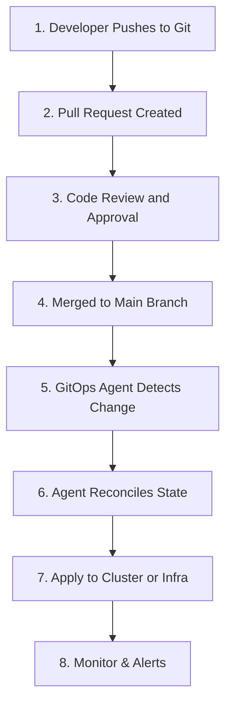

# GitOps Documentation

| Author         | Created on | Version   | Last updated by | Last edited on |
|----------------|------------|-----------|------------------|----------------|
| Meenu Chauhan  | 28-07-2025 | 1.0       | Meenu Chauhan    | 28-07-2025     |

---

## Table of Contents

1. [Introduction](#1-introduction)  
2. [What is GitOps?](#2-what-is-gitops)  
3. [Why GitOps?](#3-why-gitops)  
4. [GitOps Principles](#4-gitops-principles)  
5. [GitOps Tools](#5-gitops-tools)  
6. [GitOps Workflow and Procedures](#6-gitops-workflow-and-procedures)  
7. [GitOps Workflow Diagram](#7-gitops-workflow-diagram)  
8. [Advantages of GitOps](#8-advantages-of-gitops)  
9. [Limitations of GitOps](#9-limitations-of-gitops)  
10. [GitOps Best Practices](#10-gitops-best-practices)
11. [Conclusion](#11-conclusion) 
12. [Contact Information](#12-contact-information)  
13. [References](#13-references)  

---

## 1. Introduction

This document provides a comprehensive overview of GitOps—a modern approach for managing infrastructure and application deployments using Git as the single source of truth. It explains the GitOps concepts, its benefits and limitations, core principles, step-by-step workflows, best practices, and reference resources.  

---

## 2. What is GitOps?
GitOps is a modern approach to managing infrastructure and applications using Git as the single source of truth. All changes to infrastructure and application configuration are made through version-controlled Git commits and pull requests, enabling automated, auditable, and reliable delivery using tools like ArgoCD and Flux.

---

## 3. Why GitOps?

GitOps provides the following benefits over existing development processes:

| Benefit                    | Description                                                                                                                                                                                    |
| -------------------------- | ---------------------------------------------------------------------------------------------------------------------------------------------------------------------------------------------- |
| Productivity               | GitOps enables true continuous deployment. Developers can push every change to production, not just selected releases. This creates a faster feedback loop and increases development velocity. |
| Developer Experience       | Developers are already familiar with Git, making it easier to adopt GitOps. It eliminates the complexity of modern CI/CD tooling and reduces onboarding time.                                  |
| Reliability                | Git provides version control with forks and reverts, allowing quick rollbacks. The Git repository acts as the single source of truth, ensuring stable recovery.                                |
| Compliance & Security      | Every change to infrastructure is tracked via Git, creating a built-in audit log. GitOps allows signing commits, ensuring authorship and integrity.                                            |
| Consistency                | GitOps offers a unified change management model across traditional and cloud-native environments like Kubernetes, reducing divergence between environments.                                    |

---

## 4. GitOps Principles

| Principle                        | Description                                                                                                                                               |
|----------------------------------|-----------------------------------------------------------------------------------------------------------------------------------------------------------|
| Declarative System               | The system is defined based on the desired outcome, not the steps to reach it. You write what you want, and GitOps tools figure out how to get there.   |
| System State in Git Repository   | All configurations (desired system state) are stored in Git. This makes tracking changes, rollbacks, and audits simple and organized.                   |
| Automatic Deployment             | Once changes are approved in Git, they are automatically deployed. This keeps the actual infrastructure in sync with the desired Git version.           |

---

## 5. GitOps Tools

| Step | Tool       | Description                                                        |
|------|------------|--------------------------------------------------------------------|
| 1    | ArgoCD     | Declarative GitOps continuous delivery tool for Kubernetes         |
| 2    | Flux       | GitOps operator for syncing Git with Kubernetes                    |
| 3    | Jenkins X  | CI/CD platform with GitOps support                                 |
| 4    | Helm       | Kubernetes package manager integrated with GitOps workflows        |
| 5    | Terraform  | Infrastructure-as-Code tool that works with Git workflows          |

---

## 6. GitOps Workflow and Procedures

1. **Developer pushes code/configuration to a Git repository.**
2. **A Pull Request (PR) is created for review.**
3. **Upon approval, the PR is merged into the main branch.**
4. **A GitOps agent (e.g., ArgoCD, Flux) detects the change.**
5. **The agent reconciles and applies the change to the cluster or infrastructure.**
6. **Monitoring tools verify that the deployment is successful.**

---

## 7. GitOps Workflow Diagram

---

## 8. Advantages of GitOps 

| Advantage                           | Description                                                                                                                                                       |
| ----------------------------------- | ----------------------------------------------------------------------------------------------------------------------------------------------------------------- |
| 1. Secure & Reliable Infrastructure | Git's version control ensures that all infrastructure changes are tracked and approved by authorized personnel, reducing mistakes and unauthorized modifications. |
| 2. Controlled Approval Workflow      | Introduces a structured approval mechanism where changes are reviewed before deployment, minimizing human error and accidental changes.                           |
| 3. Full Traceability                | Every infrastructure modification is recorded in Git, providing a detailed history of what was changed, when, and by whom—making audits and debugging easier.     |
| 4. Easy Rollbacks                   | If an issue arises, GitOps enables quick rollback to a previous stable state, minimizing downtime and maintaining reliability.                                    |

---

## 9. Limitations of GitOps 

| Step | Limitation                              | Description                                                                                     |
|------|-----------------------------------------|-------------------------------------------------------------------------------------------------|
| 1    | Messy Git Repository Structure          | Mixing code and configs in one place or using one branch for all environments can cause confusion and errors.     |
| 2    | Ignoring Security                       | Leaving secrets like passwords in plain Git files or giving too many people access can lead to security issues.  |
| 3    | Making Manual Changes to Servers        | Changing things directly in production (not through Git) can break the system and cause inconsistencies.         |
| 4    | Using Too Many Complicated Tools        | Adding too many GitOps tools or using complex scripts makes things harder to manage and debug.                   |
| 5    | No Monitoring or Alerts                 | If you don’t set up alerts, you won’t know when something goes wrong with deployments or syncing.                |
| 6    | No Plan for Fixing Mistakes             | Without backups or rollback strategies, it's hard to recover if something breaks in production.                  |

---

## 10. GitOps Best Practices 

| Step | Best Practice                    | Description                                                                                   |
|------|----------------------------------|-----------------------------------------------------------------------------------------------|
| 1    | Plan Branching Strategies        | Create separate branches in Git for different environments (like dev, test, prod). This helps keep changes organized.  |
| 2    | Avoid Mixed Environments         | Manage everything (apps, configs, infrastructure) through Git. Mixing manual steps and GitOps can lead to confusion.   |
| 3    | Use Merge Requests for Discussion| Pull Requests (PRs) are a good place to talk about changes before applying them. Encourage reviews and feedback.        |
| 4    | React to Failures Immediately    | If something fails in an upstream environment (like dev), pause deployments and fix the issue in Git before continuing. |
| 5    | Use Policy as Code               | Add automatic checks (like security rules) to ensure changes meet company policies before they’re deployed.            |
| 6    | Ensure Idempotency               | Running a config multiple times should always give the same result. Use tools that ensure repeatable deployments.      |

---

## 11. Conclusion

GitOps is the application of DevOps best practices in infrastructure automation. With GitOps, you can ensure that the infrastructure is always in the desired state and that changes to infrastructure and applications can be easily tracked, tested, and deployed. The use of version control tools like Git makes the process of managing infrastructure and applications more secure and reliable, making it easier for teams to work together and make changes quickly.

---

## 12. Contact Information
| Name           | Email address                           |
|----------------|----------------------------------------|
| Meenu Chauhan  | meenu.chauhan.snaatak@mygurukulam.co   |

---

## 13. References
| Reference               | Link                                                                           |
|-------------------------|--------------------------------------------------------------------------------|
| GitOps WorkFlow         | [Click here](https://spot.io/resources/gitops/understanding-gitops-principles-workflows-deployment-types/) |
| GitOps Guide            | [Click here](https://www.redhat.com/en/topics/devops/what-is-gitops)           |
