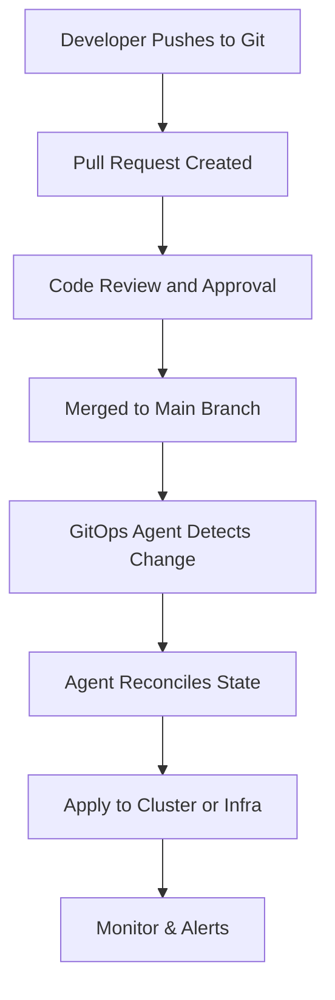

# GitOps Documentation

| Author         | Created on | Version   | Last updated by | Last edited on |
|----------------|------------|-----------|------------------|----------------|
| Meenu Chauhan  | 28-07-2025 | 1.0       | Meenu Chauhan    | 28-07-2025     |

---

## Introduction

GitOps is a modern approach to managing infrastructure and applications using Git as the single source of truth. All changes to infrastructure and application configuration are made through version-controlled Git commits and pull requests, enabling automated, auditable, and reliable delivery using tools like ArgoCD and Flux.

---

## Why GitOps?

GitOps provides the following benefits over existing development processes::

| Benefit                    | Description                                                                                                                                                                                    |
| -------------------------- | ---------------------------------------------------------------------------------------------------------------------------------------------------------------------------------------------- |
| Productivity            | GitOps enables true continuous deployment. Developers can push every change to production, not just selected releases. This creates a faster feedback loop and increases development velocity. |
| Developer Experience | Developers are already familiar with Git, making it easier to adopt GitOps. It eliminates the complexity of modern CI/CD tooling and reduces onboarding time.                                  |
| Reliability              | Git provides version control with forks and reverts, allowing quick rollbacks. The Git repository acts as the single source of truth, ensuring stable recovery.                                |
| Compliance & Security   | Every change to infrastructure is tracked via Git, creating a built-in audit log. GitOps allows signing commits, ensuring authorship and integrity.                                            |
| Consistency             | GitOps offers a unified change management model across traditional and cloud-native environments like Kubernetes, reducing divergence between environments.                                    |

---

## GitOps Principles

| Principle             | Description                                                 |
|-----------------------|-------------------------------------------------------------|
| Declarative           | Define infrastructure and application state as code         |
| Versioned & Immutable | Store and track every change through Git                    |
| Pulled Automatically  | GitOps agents watch Git and automatically apply changes     |
| Continuously Reconciled | Ensure actual system state matches the desired state in Git |

---

## GitOps Tools

| Tool       | Description                                                        |
|------------|--------------------------------------------------------------------|
| ArgoCD     | Declarative GitOps continuous delivery tool for Kubernetes         |
| Flux       | GitOps operator for syncing Git with Kubernetes                    |
| Jenkins X  | CI/CD platform with GitOps support                                 |
| Helm       | Kubernetes package manager integrated with GitOps workflows        |
| Terraform  | Infrastructure-as-Code tool that works with Git workflows          |

---

## GitOps Workflow and Procedures

1. Developer pushes code/configuration to a Git repository.
2. A Pull Request (PR) is created for review.
3. Upon approval, the PR is merged into the main branch.
4. A GitOps agent (e.g., ArgoCD, Flux) detects the change.
5. The agent reconciles and applies the change to the cluster or infrastructure.
6. Monitoring tools verify that the deployment is successful.

---

## GitOps Workflow Diagram

---

## Advantages of GitOps 

| Advantage                           | Description                                                                                                                                                       |
| ----------------------------------- | ----------------------------------------------------------------------------------------------------------------------------------------------------------------- |
|  Secure & Reliable Infrastructure | Git's version control ensures that all infrastructure changes are tracked and approved by authorized personnel, reducing mistakes and unauthorized modifications. |
|  Controlled Approval Workflow      | Introduces a structured approval mechanism where changes are reviewed before deployment, minimizing human error and accidental changes.                           |
|  Full Traceability                | Every infrastructure modification is recorded in Git, providing a detailed history of what was changed, when, and by whom—making audits and debugging easier.     |
|  Easy Rollbacks                   | If an issue arises, GitOps enables quick rollback to a previous stable state, minimizing downtime and maintaining reliability.                                    |

## Limitations of GitOps 

| Limitation                              | Description                                                                                     |
|--------------------------------------|-------------------------------------------------------------------------------------------------------------------|
| Messy Git Repository Structure       | Mixing code and configs in one place or using one branch for all environments can cause confusion and errors.     |
| Ignoring Security                    | Leaving secrets like passwords in plain Git files or giving too many people access can lead to security issues.  |
| Making Manual Changes to Servers     | Changing things directly in production (not through Git) can break the system and cause inconsistencies.         |
| Using Too Many Complicated Tools     | Adding too many GitOps tools or using complex scripts makes things harder to manage and debug.                   |
| No Monitoring or Alerts              | If you don’t set up alerts, you won’t know when something goes wrong with deployments or syncing.                |
| No Plan for Fixing Mistakes          | Without backups or rollback strategies, it's hard to recover if something breaks in production.                  |

## GitOps Best Practices 

| Best Practice                    | Desscription                                                                                   |
|----------------------------------|-------------------------------------------------------------------------------------------------------------------------|
| Plan Branching Strategies        | Create separate branches in Git for different environments (like dev, test, prod). This helps keep changes organized.  |
| Avoid Mixed Environments         | Manage everything (apps, configs, infrastructure) through Git. Mixing manual steps and GitOps can lead to confusion.   |
| Use Merge Requests for Discussion| Pull Requests (PRs) are a good place to talk about changes before applying them. Encourage reviews and feedback.        |
| React to Failures Immediately    | If something fails in an upstream environment (like dev), pause deployments and fix the issue in Git before continuing. |
| Use Policy as Code               | Add automatic checks (like security rules) to ensure changes meet company policies before they’re deployed.            |
| Ensure Idempotency               | Running a config multiple times should always give the same result. Use tools that ensure repeatable deployments.      |

